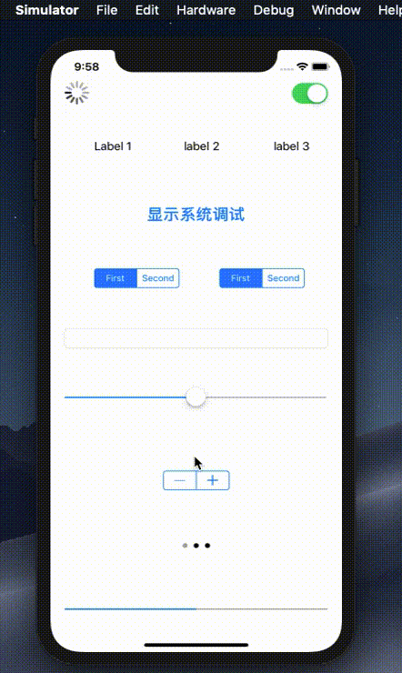

# OrzSysDebug

A tool to enable UIDebuggingInformationOverlay for iOS 10 &amp; 11 &amp; 12.


## Usage

The Pod Use Apple's Private API, so you should only depend this pod for debug Target, not for AppleStore Package.

## Add to Podfile

```
source 'https://github.com/OrzGeeker/Specs.git'
source 'https://github.com/CocoaPods/Specs.git'

pod 'OrzSysDebug', :configurations => ['Debug']
```

## Show The Debug Overlay

1. You can tap status bar with two fingers to show `UIDebuggingInformationOverlay`,
this method is non-code intrusion。

2. If you want show debug overlay with code,  refer to the following example:

```
#import "ViewController.h"
#import <OrzSysDebug/OrzSysDebug.h>
@interface ViewController ()

@end

@implementation ViewController

- (void)viewDidLoad {
    [super viewDidLoad];
    // Do any additional setup after loading the view.
}


- (BOOL)canBecomeFirstResponder {
    return YES;
}

// Motion Event
-(void)motionEnded:(UIEventSubtype)motion withEvent:(UIEvent *)event {
    if(motion != UIEventSubtypeMotionShake) return;
    [OrzSysDebug toggle];
}

// Button Action
- (IBAction)showSysDebug:(UIButton *)sender {
    [OrzSysDebug toggle];
}

@end
```

## Demo

### show the debug layer



### the features of debuy layer


